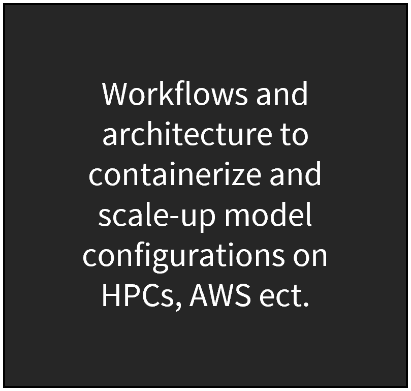
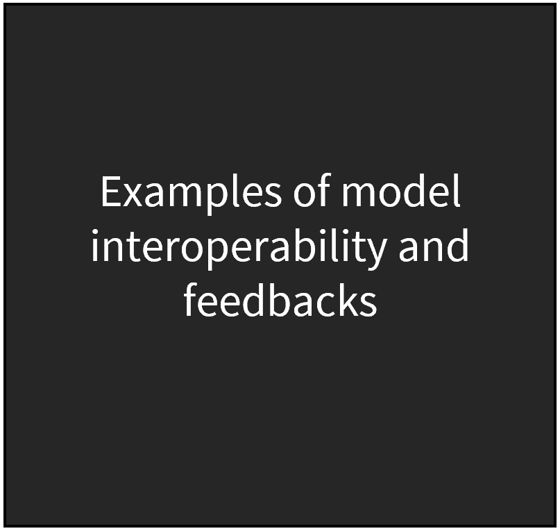
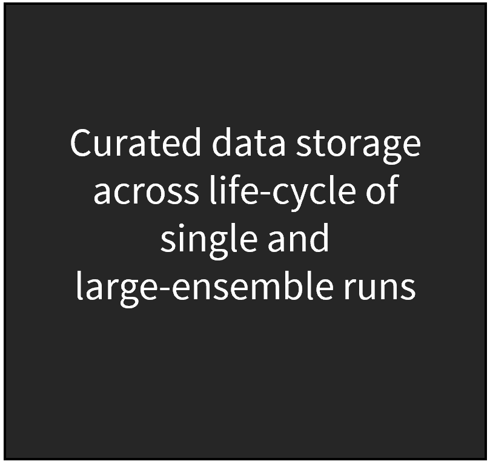
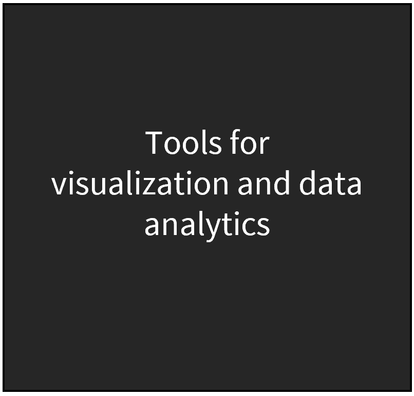

```{r setup, echo = F}
knitr::opts_chunk$set(echo=FALSE, out.width="100%", results = "show")
```

<!-------------------------->
<!-------------------------->
<h1 style="float:left;font-size:60px;vertical-align:middle"> Welcome </h1>

<!-------------------------->
<!-------------------------->
<p align="center"> </p>

GCIMS Integration promotes transparent, robust and reproducible workflows by maintaining, testing and validating the various tools and data used across the GCIMS ecosystem. The effort is divided into the following six focus areas.

<p align="center"> </p>

<div class="container_map_outer">
<div class="container_map">
```{r software}
knitr::include_graphics('images/index_software.PNG')
```
<div class="img-top">
  <a href = "index.html">
```{r software_top}

```
</a>
</div>
</div>
<div class="container_map">
```{r standards}
knitr::include_graphics('images/index_standards.PNG')
```
<div class="img-top">
  <a href = "index.html">
```{r standards_top}

```
</a>
</div>
</div>
<div class="container_map">
```{r workflows}
knitr::include_graphics('images/index_workflows.PNG')
```
<div class="img-top">
  <a href = "index.html">
```{r workflows_top}

```
</a>
</div>
</div>
</div>

<div class="container_map_outer">
<div class="container_map">
```{r feedbacks}
knitr::include_graphics('images/index_feedbacks.PNG')
```
<div class="img-top">
  <a href = "index.html">
```{r feedbacks_top}

```
</a>
</div>
</div>
<div class="container_map">
```{r data}
knitr::include_graphics('images/index_data.PNG')
```
<div class="img-top">
  <a href = "index.html">
```{r data_top}

```
</a>
</div>
</div>
<div class="container_map">
```{r visual}
knitr::include_graphics('images/index_visual.PNG')
```
<div class="img-top">
  <a href = "index.html">
```{r visual_top}

```
</a>
</div>
</div>
</div>

