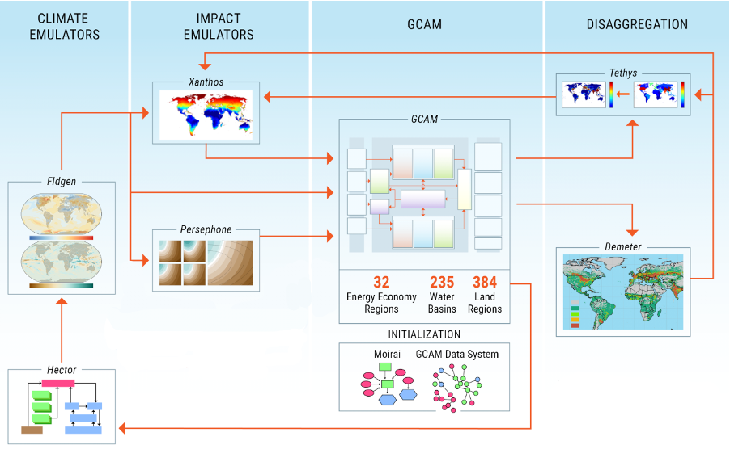

<div class="header_logo">


</div>

<!-------------------------->
<!-------------------------->
### **GCIMS Integration**
<!-------------------------->
<!-------------------------->
<p align="center"> </p>

<a href = "integration.html">
```{r, echo=FALSE, out.width="80%", fig.align='center'}

```
</a>

This website describes the integration of GCIMS tools focusing on standardized and efficient data management, seamlessly interoperability, feedbacks between models and community access to curated large ensemble scenario inputs and outputs.

<p align="center"> </p>
