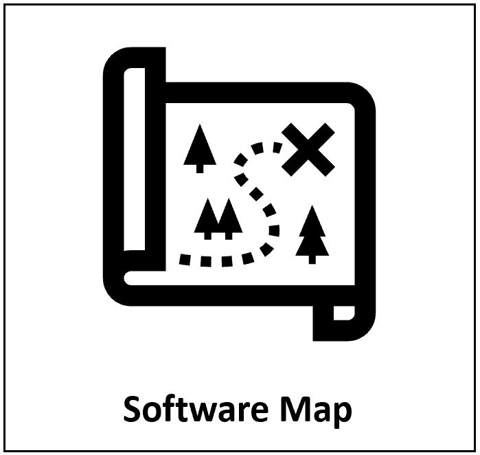
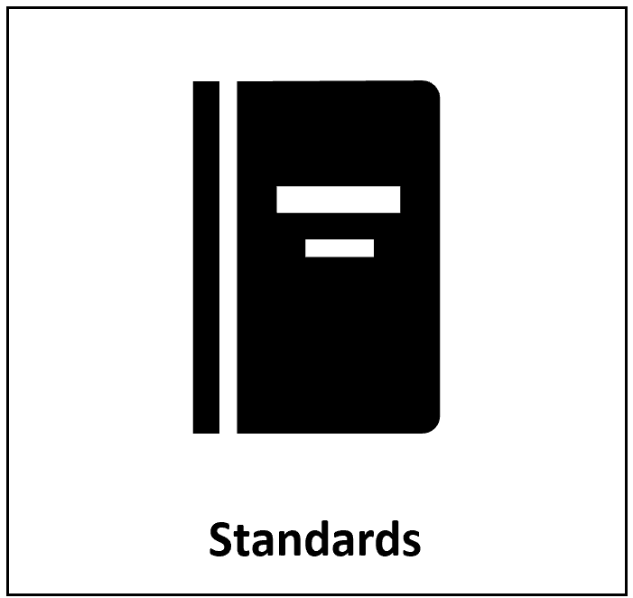
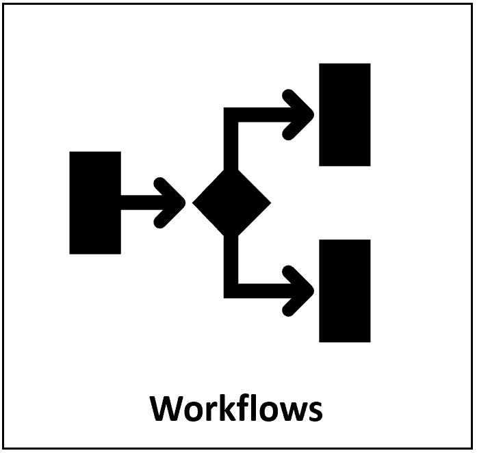
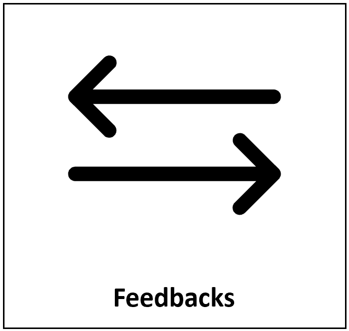
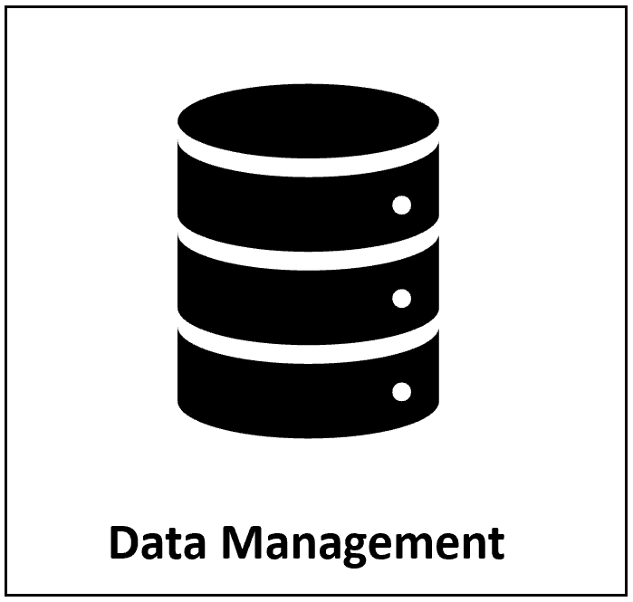
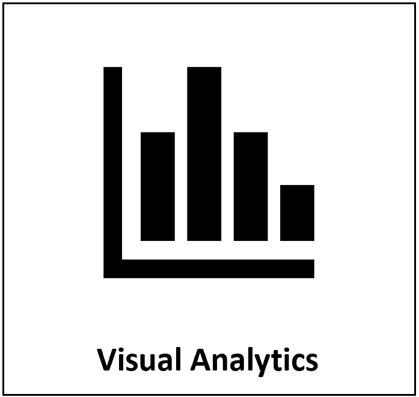

```{r setup, echo = F}
knitr::opts_chunk$set(echo=FALSE, out.width="100%", results = "show")
```

<!-------------------------->
<!-------------------------->
<h1 style="float:left;font-size:60px;vertical-align:middle"> Welcome </h1>

<!-------------------------->
<!-------------------------->
<p align="center"> </p>

GCIMS Integration promotes transparent, robust and reproducible workflows by maintaining, testing and validating the various tools and data used across the GCIMS ecosystem. The effort is divided into the following six focus areas.

<p align="center"> </p>

<div class="container_outer_index">
<div class="container_index">
 
 <div class="overlay_index">
 <a href = "software.html" class="text_index">Maintain map of existing and new software</a>
 </div>
</div>
<div class="container_index">
 
 <div class="overlay_index">
 <a href = "standards.html" class="text_index">Best practice for data storage, software, CI/CD</a>
 </div>
</div>
<div class="container_index">
 
 <div class="overlay_index">
 <a href = "workflows.html" class="text_index">Containerized, scalable, robust, and reproducible architecture</a>
 </div>
</div>
</div>
<div class="container_outer_index">
<div class="container_index">
 
 <div class="overlay_index">
 <a href = "feedbacks.html" class="text_index">Model interoperability and feedbacks</a>
 </div>
</div>
<div class="container_index">
 
 <div class="overlay_index">
 <a href = "data.html" class="text_index">Curated data across life-cycle of model runs</a>
 </div>
</div>
<div class="container_index">
 
 <div class="overlay_index">
 <a href = "visual.html" class="text_index">Tools for visualization and analytics</a>
 </div>
</div>
</div>

