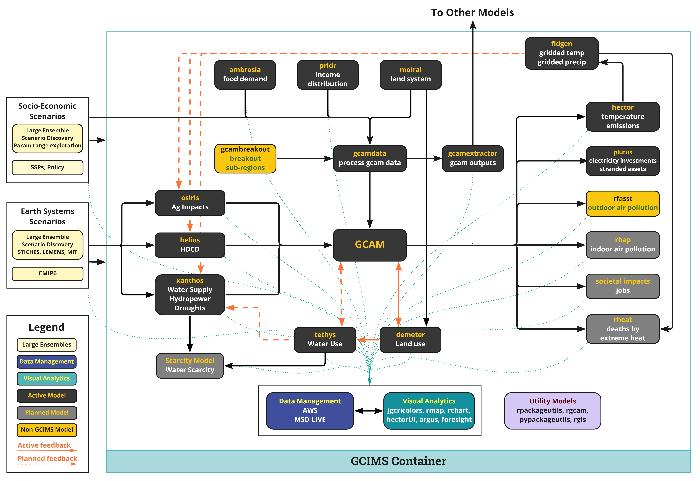

```{r child = 'header.rmd'}
```

<br>

<!-------------------------->
<!-------------------------->
# Software Map
<!-------------------------->
<!-------------------------->
<p align="center"> </p>

<div class="image_gray">

</div>

<br>

<!-------------------------->
<!-------------------------->
# Interactive Software Map {.tabset}
<!-------------------------->
<!-------------------------->
<p align="center"> </p>

## Check Upstream

```{r netwrok_up, results = TRUE, echo = FALSE, message = FALSE, warning = FALSE, out.width="100%"}
library(visNetwork, quietly = TRUE); library(dplyr); library(tibble)
# minimal example
nodes <- tribble(
  ~id, ~label, ~group, ~x, ~y, ~fixed, ~shape, ~color,
  "socio-econ", "socio-econ", "Raw Inputs", -600, -400, TRUE, "dot", "#fef7c0",
  "climate", "climate", "Raw Inputs", -600, 0, TRUE, "dot", "#fef7c0",
  "policy", "policy", "Raw Inputs", -600, -200, TRUE, "dot", "#fef7c0",
   "ambrosia", "ambrosia", "Active",  -400, -400, TRUE,"dot", "#373737",
   "pridr", "pridr", "Active",  -200, -400, TRUE,"dot", "#373737",
   "moirai", "moirai", "Active",  0, -400, TRUE,"dot", "#373737",
  "osiris", "osiris", "Active",  -400, -200, TRUE,"dot", "#373737",
  "helios", "helios", "Active",  -400, 0, TRUE,"dot", "#373737",
  "xanthos", "xanthos", "Active", -400, 200, TRUE,"dot", "#373737",
  "gcamdata", "gcamdata", "Active", -200, -200,TRUE, "dot", "#373737",
  "gcamextractor", "gcamextractor", "Active", 200, -200,TRUE, "dot", "#373737",
  "others", "others", "Other Models", 350, -500,TRUE, "dot", "white",
  "gcambreakout", "gcambreakout", "non-GCIMS", 50, -300, TRUE, "dot", "#f9c710",
  "GCAM", "GCAM", "Active", 0, 0, TRUE, "dot", "#373737",
  "demeter", "demeter", "Active", 100, 200, TRUE,"dot", "#373737",
  "tethys", "tethys", "Active", -100, 200, TRUE,"dot", "#373737",
  "water scarcity", "water scarcity", "Planned", -300, 400, TRUE,"dot", "#808080",
  "hector", "hector", "Active", 400, -300, TRUE,"dot", "#373737",
  "plutus", "plutus", "Active", 400, -150, TRUE,"dot", "#373737",
  "rfasst", "rfaast", "non-GCIMS", 400, 0, TRUE,"dot", "#f9c710",
  "rhap", "rhap", "Planned", 400, 150, TRUE,"dot", "#808080",
   "societal", "societal", "Planned", 400, 300, TRUE,"dot", "#808080",
   "rheat", "rheat", "Planned", 400, 450, TRUE,"dot", "#808080",
  "stitches", "stitches", "Active", 200, -400, TRUE,"dot", "#373737",
  "database", "database", "Database", 0, 500, TRUE,"dot", "#3f4f9d",
  "visual analytics", "visual analytics", "visual", 200, 500, TRUE,"dot", "#12909e",
) %>% dplyr::mutate(smooth=TRUE, border="", shadow=TRUE)

# Check gravity
#nodes <- nodes %>% mutate(x=NULL, y=NULL, fixed=FALSE)

edges <- tribble(
  ~from,   ~to, ~arrows, ~color, ~dashes,
  "policy",  "GCAM", "to", list(color = "black", highlight = "black"), FALSE,
  "socio-econ",  "gcamdata", "to", list(color = "black", highlight = "black"), FALSE,
  "climate",  "osiris", "to", list(color = "black", highlight = "black"), FALSE,
  "climate",  "helios", "to", list(color = "black", highlight = "black"), FALSE,
  "climate",  "xanthos", "to", list(color = "black", highlight = "black"), FALSE,
  "ambrosia", "gcamdata", "to", list(color = "black", highlight = "black"), FALSE,
  "pridr", "gcamdata", "to", list(color = "black", highlight = "black"), FALSE,
  "moirai", "gcamdata", "to", list(color = "black", highlight = "black"), FALSE,
  "gcambreakout", "gcamdata", "to", list(color = "black", highlight = "black"), FALSE,
  "helios", "GCAM", "to", list(color = "black", highlight = "black"), FALSE,
  "osiris", "GCAM", "to", list(color = "black", highlight = "black"), FALSE,
  "xanthos", "GCAM", "to", list(color = "black", highlight = "black"), FALSE,
  "gcamdata", "GCAM", "to", list(color = "black", highlight = "black"), FALSE,
  "GCAM",  "demeter", "to", list(color = "black", highlight = "black"), FALSE,
  "demeter",  "GCAM", "to", list(color = "red", highlight = "red"), TRUE,
  "demeter",  "tethys", "to", list(color = "red", highlight = "red"), TRUE,
  "GCAM",  "tethys", "to", list(color = "black", highlight = "black"), FALSE,
  "tethys",  "GCAM", "to", list(color = "red", highlight = "red"), TRUE,
  "tethys", "xanthos", "to", list(color = "red", highlight = "red"), TRUE,
  "tethys", "water scarcity", "to", list(color = "black", highlight = "black"), FALSE,
  "xanthos", "water scarcity", "to", list(color = "black", highlight = "black"), FALSE,
  "GCAM",  "hector", "to", list(color = "black", highlight = "black"), FALSE,
  "hector",  "stitches", "to", list(color = "black", highlight = "black"), FALSE,
   "stitches",  "osiris", "to", list(color = "red", highlight = "red"), TRUE,
   "stitches",  "helios", "to", list(color = "red", highlight = "red"), TRUE,
   "stitches",  "xanthos", "to", list(color = "red", highlight = "red"), TRUE,
  "gcamdata", "gcamextractor", "to", list(color = "black", highlight = "black"), FALSE,
  "GCAM",  "gcamextractor", "to", list(color = "black", highlight = "black"), FALSE,
  "gcamextractor",  "others", "to", list(color = "black", highlight = "black"), FALSE,
   "GCAM",  "plutus", "to", list(color = "black", highlight = "black"), FALSE,
   "GCAM",  "rfasst", "to", list(color = "black", highlight = "black"), FALSE,
   "GCAM",  "rhap", "to", list(color = "black", highlight = "black"), FALSE,
   "GCAM",  "societal", "to", list(color = "black", highlight = "black"), FALSE,
   "GCAM",  "rheat", "to", list(color = "black", highlight = "black"), FALSE,
  # To database
  "CMIP6", "database", "to", list(color = "#0ea585", highlight = "#0ea585", width=0.5), TRUE,
  "SSPs", "database", "to", list(color = "#0ea585", highlight = "#0ea585", width=0.5), TRUE,
  "GCAM",  "database", "to", list(color = "#0ea585", highlight = "#0ea585", width=0.5), TRUE,
  "xanthos", "database", "to", list(color = "#0ea585", highlight = "#0ea585", width=0.5), TRUE,
  "demeter", "database", "to", list(color = "#0ea585", highlight = "#0ea585", width=0.5), TRUE,
  "osiris", "database", "to", list(color = "#0ea585", highlight = "#0ea585", width=0.5), TRUE,
  "helios", "database", "to", list(color = "#0ea585", highlight = "#0ea585", width=0.5), TRUE,
  "tethys", "database", "to", list(color = "#0ea585", highlight = "#0ea585", width=0.5), TRUE,
  "water scarcity", "database", "to", list(color = "#0ea585", highlight = "#0ea585", width=0.5), TRUE,
  "hector", "database", "to", list(color = "#0ea585", highlight = "#0ea585", width=0.5), TRUE,
  "stitches", "database", "to", list(color = "#0ea585", highlight = "#0ea585", width=0.5), TRUE,
   "plutus", "database", "to", list(color = "#0ea585", highlight = "#0ea585", width=0.5), TRUE,
   "societal", "database", "to", list(color = "#0ea585", highlight = "#0ea585", width=0.5), TRUE,
    "rfasst", "database", "to", list(color = "#0ea585", highlight = "#0ea585", width=0.5), TRUE,
   "rhap", "database", "to", list(color = "#0ea585", highlight = "#0ea585", width=0.5), TRUE,
   "rheat", "database", "to", list(color = "#0ea585", highlight = "#0ea585", width=0.5), TRUE,
   "database", "visual analytics", "to;from", list(color = "#0ea585", highlight = "#0ea585", width=0.5), TRUE) %>% 
  dplyr::mutate(smooth=TRUE)


ledges <- data.frame(color = c("red", "#0ea585"),
                     label = c("feedback", "to database"), 
                     arrows =c("to","to"),
                     width = c(1,0.5))

lnodes <- data.frame(label = c("Raw Inputs","Active", "Planned", 
                               "Database", "Visual", "Non-GCIMS",
                               "Other Models"),
                     shape = c( "dot","dot", "dot",
                                "dot","dot", "dot",
                                "dot"), 
                     color = c("#fef7c0","#373737", "#808080",
                               "#3f4f9d","#12909e","#f9c710",
                               "white"))%>%
  dplyr::mutate(smooth=TRUE, border="#474747", shadow=TRUE)

visNetwork(nodes, edges, width = "100%", submain="Click on a node to see upstream model dependencies")%>% 
  visOptions(highlightNearest =  list(enabled = TRUE, 
                                      algorithm = "hierarchical", 
                                      hover = T,
                                      degree = list(from = 50, to = 0)),
             nodesIdSelection = FALSE) %>%
  visLegend(
            position = "right", main = "Legend",
            addNodes = lnodes, useGroups = FALSE, addEdges = ledges)%>% 
   visInteraction(navigationButtons = TRUE)

```

<br>

## Check Downstream

```{r network_down, results = TRUE, echo = FALSE, message = FALSE, warning = FALSE, out.width="100%"}
library(visNetwork, quietly = TRUE); library(dplyr); library(tibble)
# minimal example
nodes <- tribble(
  ~id, ~label, ~group, ~x, ~y, ~fixed, ~shape, ~color,
  "socio-econ", "socio-econ", "Raw Inputs", -600, -400, TRUE, "dot", "#fef7c0",
  "climate", "climate", "Raw Inputs", -600, 0, TRUE, "dot", "#fef7c0",
  "policy", "policy", "Raw Inputs", -600, -200, TRUE, "dot", "#fef7c0",
   "ambrosia", "ambrosia", "Active",  -400, -400, TRUE,"dot", "#373737",
   "pridr", "pridr", "Active",  -200, -400, TRUE,"dot", "#373737",
   "moirai", "moirai", "Active",  0, -400, TRUE,"dot", "#373737",
  "osiris", "osiris", "Active",  -400, -200, TRUE,"dot", "#373737",
  "helios", "helios", "Active",  -400, 0, TRUE,"dot", "#373737",
  "xanthos", "xanthos", "Active", -400, 200, TRUE,"dot", "#373737",
  "gcamdata", "gcamdata", "Active", -200, -200,TRUE, "dot", "#373737",
  "gcamextractor", "gcamextractor", "Active", 200, -200,TRUE, "dot", "#373737",
  "others", "others", "Other Models", 350, -500,TRUE, "dot", "white",
  "gcambreakout", "gcambreakout", "non-GCIMS", 50, -300, TRUE, "dot", "#f9c710",
  "GCAM", "GCAM", "Active", 0, 0, TRUE, "dot", "#373737",
  "demeter", "demeter", "Active", 100, 200, TRUE,"dot", "#373737",
  "tethys", "tethys", "Active", -100, 200, TRUE,"dot", "#373737",
  "water scarcity", "water scarcity", "Planned", -300, 400, TRUE,"dot", "#808080",
  "hector", "hector", "Active", 400, -300, TRUE,"dot", "#373737",
  "plutus", "plutus", "Active", 400, -150, TRUE,"dot", "#373737",
  "rfasst", "rfaast", "non-GCIMS", 400, 0, TRUE,"dot", "#f9c710",
  "rhap", "rhap", "Planned", 400, 150, TRUE,"dot", "#808080",
   "societal", "societal", "Planned", 400, 300, TRUE,"dot", "#808080",
   "rheat", "rheat", "Planned", 400, 450, TRUE,"dot", "#808080",
  "stitches", "stitches", "Active", 200, -400, TRUE,"dot", "#373737",
  "database", "database", "Database", 0, 500, TRUE,"dot", "#3f4f9d",
  "visual analytics", "visual analytics", "visual", 200, 500, TRUE,"dot", "#12909e",
) %>% dplyr::mutate(smooth=TRUE, border="", shadow=TRUE)

# Check gravity
#nodes <- nodes %>% mutate(x=NULL, y=NULL, fixed=FALSE)

edges <- tribble(
  ~from,   ~to, ~arrows, ~color, ~dashes,
  "policy",  "GCAM", "to", list(color = "black", highlight = "black"), FALSE,
  "socio-econ",  "gcamdata", "to", list(color = "black", highlight = "black"), FALSE,
  "climate",  "osiris", "to", list(color = "black", highlight = "black"), FALSE,
  "climate",  "helios", "to", list(color = "black", highlight = "black"), FALSE,
  "climate",  "xanthos", "to", list(color = "black", highlight = "black"), FALSE,
  "ambrosia", "gcamdata", "to", list(color = "black", highlight = "black"), FALSE,
  "pridr", "gcamdata", "to", list(color = "black", highlight = "black"), FALSE,
  "moirai", "gcamdata", "to", list(color = "black", highlight = "black"), FALSE,
  "gcambreakout", "gcamdata", "to", list(color = "black", highlight = "black"), FALSE,
  "helios", "GCAM", "to", list(color = "black", highlight = "black"), FALSE,
  "osiris", "GCAM", "to", list(color = "black", highlight = "black"), FALSE,
  "xanthos", "GCAM", "to", list(color = "black", highlight = "black"), FALSE,
  "gcamdata", "GCAM", "to", list(color = "black", highlight = "black"), FALSE,
  "GCAM",  "demeter", "to", list(color = "black", highlight = "black"), FALSE,
  "demeter",  "GCAM", "to", list(color = "red", highlight = "red"), TRUE,
  "demeter",  "tethys", "to", list(color = "red", highlight = "red"), TRUE,
  "GCAM",  "tethys", "to", list(color = "black", highlight = "black"), FALSE,
  "tethys",  "GCAM", "to", list(color = "red", highlight = "red"), TRUE,
  "tethys", "xanthos", "to", list(color = "red", highlight = "red"), TRUE,
  "tethys", "water scarcity", "to", list(color = "black", highlight = "black"), FALSE,
  "xanthos", "water scarcity", "to", list(color = "black", highlight = "black"), FALSE,
  "GCAM",  "hector", "to", list(color = "black", highlight = "black"), FALSE,
  "hector",  "stitches", "to", list(color = "black", highlight = "black"), FALSE,
   "stitches",  "osiris", "to", list(color = "red", highlight = "red"), TRUE,
   "stitches",  "helios", "to", list(color = "red", highlight = "red"), TRUE,
   "stitches",  "xanthos", "to", list(color = "red", highlight = "red"), TRUE,
  "gcamdata", "gcamextractor", "to", list(color = "black", highlight = "black"), FALSE,
  "GCAM",  "gcamextractor", "to", list(color = "black", highlight = "black"), FALSE,
  "gcamextractor",  "others", "to", list(color = "black", highlight = "black"), FALSE,
   "GCAM",  "plutus", "to", list(color = "black", highlight = "black"), FALSE,
   "GCAM",  "rfasst", "to", list(color = "black", highlight = "black"), FALSE,
   "GCAM",  "rhap", "to", list(color = "black", highlight = "black"), FALSE,
   "GCAM",  "societal", "to", list(color = "black", highlight = "black"), FALSE,
   "GCAM",  "rheat", "to", list(color = "black", highlight = "black"), FALSE,
  # To database
  "CMIP6", "database", "to", list(color = "#0ea585", highlight = "#0ea585", width=0.5), TRUE,
  "SSPs", "database", "to", list(color = "#0ea585", highlight = "#0ea585", width=0.5), TRUE,
  "GCAM",  "database", "to", list(color = "#0ea585", highlight = "#0ea585", width=0.5), TRUE,
  "xanthos", "database", "to", list(color = "#0ea585", highlight = "#0ea585", width=0.5), TRUE,
  "demeter", "database", "to", list(color = "#0ea585", highlight = "#0ea585", width=0.5), TRUE,
  "osiris", "database", "to", list(color = "#0ea585", highlight = "#0ea585", width=0.5), TRUE,
  "helios", "database", "to", list(color = "#0ea585", highlight = "#0ea585", width=0.5), TRUE,
  "tethys", "database", "to", list(color = "#0ea585", highlight = "#0ea585", width=0.5), TRUE,
  "water scarcity", "database", "to", list(color = "#0ea585", highlight = "#0ea585", width=0.5), TRUE,
  "hector", "database", "to", list(color = "#0ea585", highlight = "#0ea585", width=0.5), TRUE,
  "stitches", "database", "to", list(color = "#0ea585", highlight = "#0ea585", width=0.5), TRUE,
   "plutus", "database", "to", list(color = "#0ea585", highlight = "#0ea585", width=0.5), TRUE,
   "societal", "database", "to", list(color = "#0ea585", highlight = "#0ea585", width=0.5), TRUE,
    "rfasst", "database", "to", list(color = "#0ea585", highlight = "#0ea585", width=0.5), TRUE,
   "rhap", "database", "to", list(color = "#0ea585", highlight = "#0ea585", width=0.5), TRUE,
   "rheat", "database", "to", list(color = "#0ea585", highlight = "#0ea585", width=0.5), TRUE,
   "database", "visual analytics", "to;from", list(color = "#0ea585", highlight = "#0ea585", width=0.5), TRUE) %>% 
  dplyr::mutate(smooth=TRUE)


ledges <- data.frame(color = c("red", "#0ea585"),
                     label = c("feedback", "to database"), 
                     arrows =c("to","to"),
                     width = c(1,0.5))

lnodes <- data.frame(label = c("Raw Inputs","Active", "Planned", 
                               "Database", "Visual", "Non-GCIMS",
                               "Other Models"),
                     shape = c( "dot","dot", "dot",
                                "dot","dot", "dot",
                                "dot"), 
                     color = c("#fef7c0","#373737", "#808080",
                               "#3f4f9d","#12909e","#f9c710",
                               "white"))%>%
  dplyr::mutate(smooth=TRUE, border="#474747", shadow=TRUE)

visNetwork(nodes, edges, width = "100%", submain="Click on a node to see downstream model dependencies")%>% 
  visOptions(highlightNearest =  list(enabled = TRUE, 
                                      algorithm = "hierarchical", 
                                      hover = T,
                                      degree = list(from = 0, to = 50)),
             nodesIdSelection = FALSE) %>%
  visLegend(
            position = "right", main = "Legend",
            addNodes = lnodes, useGroups = FALSE, addEdges = ledges)%>% 
   visInteraction(navigationButtons = TRUE)

```


<br>


